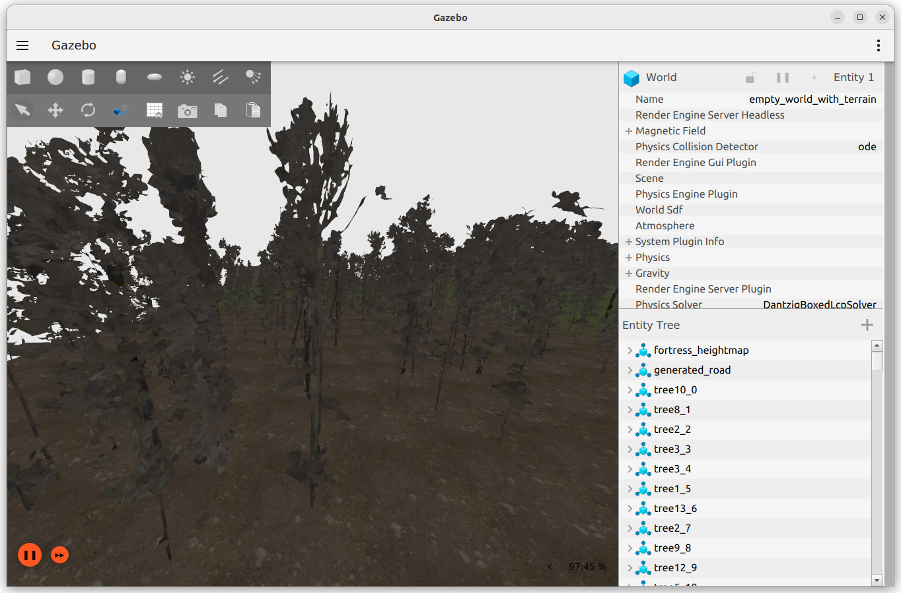

# forest_map_generator (ROS2 Humble + Gazebo Fortress)

A ROS 2 package for generating forest simulation environments in Gazebo Fortress, including
terrain heightmaps, procedural tree placement, and road mesh generation.

<p align="center">
  
</p>

---

## Overview

This project provides a complete pipeline to build a forest scene for Gazebo from:
1) a terrain heightmap (PNG) used by the `terrain` model, and  
2) tree assets (either built-in models such as `oak_tree` / `pine_tree`, or textured meshes generated from point clouds).

The core workflow is:

1) **Acquire a terrain heightmap**
   - Select a geographic region of interest and export a digital elevation model (DEM) as a heightmap.
   - Public DEM-to-heightmap services can be used to obtain real-world terrain heightmaps for almost any location worldwide (e.g., https://dx3377.com/dem/heightmap).
   - Export/download the terrain as a heightmap image and ensure it meets the Gazebo format requirements below.

2) **Prepare a Gazebo-compatible heightmap**
   - Convert or export the heightmap as a single-channel (grayscale) PNG.
   - Ensure the heightmap is square and follows Gazebo heightmap requirements (`N × N`, where `N = 2^k + 1`).
   - Use 8-bit grayscale (`0–255`) unless a higher bit-depth workflow is explicitly required.
   - Set `terrain_size_x` and `terrain_size_y` to match the actual heightmap resolution.  
     These values are automatically reported during heightmap loading and terrain/SDF update,
     and can be verified from the printed image dimensions in the console output.

3) **Update the terrain model**
   - `scripts/update_heightmap/main.py` updates `models/terrain/model.sdf`, including:
     - heightmap URI
     - heightmap size and vertical scale
     - texture blending parameters
     - terrain pose
   - The script also copies the heightmap PNG into:
     - `models/terrain/materials/textures/`
   - This ensures the heightmap is discoverable by Gazebo at runtime.

4) **Generate the forest world**
   - `forest_map_generator/forest_map_generator.py` (ROS 2 node) generates a new `.world` file by inserting:
     - randomly placed tree `<include>` blocks (slope-aware and minimum-distance constrained)
     - an automatically generated road mesh (`models/road/meshes/road.stl`) and the corresponding road `<include>`
   - Tree and road placement are evaluated directly on the heightmap using shared terrain logic.

5) **Create Gazebo-ready tree models from point clouds (optional)**
   - `scripts/ply_to_gazebo_textured/main.py` converts colored `.ply` point clouds into Gazebo-ready tree models under `models/<tree_name>/`, including:
     - `meshes/tree_mesh.dae` (visual mesh)
     - `meshes/tree_collision.stl` (collision mesh)
     - `meshes/<tree_name>_albedo.png` (texture baked via Blender)

This pipeline enables reproducible construction of large-scale forest environments in Gazebo from either synthetic or real-world terrain data.


The package is structured as an `ament_python` ROS 2 package and is intended for research workflows where repeatable generation of natural outdoor scenes is required.

---

## Repository Layout


```text
forest_map_generator/
├── forest_map_generator/
│   └── forest_map_generator.py        # ROS 2 node (tree & road generation)
│
├── scripts/
│   ├── update_heightmap/
│   │   └── main.py                    # Heightmap → terrain SDF update
│   │
│   └── ply_to_gazebo_textured/
│       ├── main.py                    # PLY → Gazebo tree model pipeline
│       └── bake_vcol_to_texture.py    # Blender texture baking (called by main.py)
│
├── models/
│   ├── terrain/                       # Heightmap-based terrain model
│   ├── road/                          # Generated road model
│   ├── oak_tree/                      # Predefined tree model
│   ├── pine_tree/                     # Predefined tree model
│   └── tree*/                         # Auto-generated tree instances
│
├── worlds/
│   └── world.world                    # Base Gazebo world
│
├── launch/
│   ├── gazebo.launch.py
│   └── tree_generator.launch.py
│
└── docs/
    └── images/
        └── gazebo_overview.png

```

---

## Key Components

- 'ForestMapGenerator (ROS 2 node)': generates a new world file by injecting trees and roads into a base world.

- 'TerrainHelper': shared utility class for heightmap loading, pixel–world coordinate conversion, and terrain slope computation.

- 'TreeGenerator': slope-aware random tree placement on the heightmap, built on top of TerrainHelper.

- 'RoadGenerator': generates a smooth road mesh (road.stl) while respecting terrain slope and minimum clearance from trees.

- 'update_heightmap script': updates terrain SDF parameters and ensures the heightmap image is placed in the correct model path for Gazebo.

- 'ply_to_gazebo_textured pipeline': converts colored point clouds into textured Gazebo-ready meshes using Open3D and Blender texture baking.

### 1. ForestMapGenerator (ROS 2 Node)

**Location**
```text
forest_map_generator/forest_map_generator.py
```

**Role**

Primary ROS 2 node that procedurally generates a forest simulation world by injecting trees (and optionally roads) into a base Gazebo world.
The node samples valid placements directly on the terrain heightmap, converts heightmap pixels into world-frame poses, and writes a new .world file under worlds/.

**Execution Flow**
1. Load the terrain heightmap and compute local slope information
2. Sample valid tree positions subject to slope and distance constraints
3. Convert heightmap pixels to world-frame poses
4. Inject generated tree instances into a new Gazebo world file

**Launch Command**
```text
ros2 launch forest_map_generator tree_generator.launch.py
```

The node writes a generated world file to the package worlds/ directory (see output_world_file below).

**Paraments**

| Parameter | Type | Description |
|----------|------|-------------|
| `heightmap_file` | `string` | Heightmap image filename under `models/terrain/heightmaps/`. Used for terrain elevation lookup and slope computation. |
| `num_trees` | `int` | Number of trees to generate and inject into the world. |
| `tree_types` | `list[string]` | List of Gazebo model names available under `models/` (e.g., `tree1`–`tree14`). A random type is selected per placement. |
| `terrain_size_x` | `int` | Heightmap resolution in X (pixels). Must match the heightmap image width. |
| `terrain_size_y` | `int` | Heightmap resolution in Y (pixels). Must match the heightmap image height. |
| `terrain_size_z` | `float` | Terrain vertical scale in meters used to convert heightmap values to world Z. |
| `min_tree_distance` | `float` | Minimum allowed distance (meters) between any two trees. |
| `max_slope` | `float` | Maximum allowed slope (degrees) for valid placements. Trees are rejected on steep terrain. |
| `output_world_file` | `string` | Output world filename written to `worlds/` (e.g., `world_with_trees.world`). |

Note: Several of the parameters above are automatically printed during heightmap loading and SDF update for verification and reproducibility.  
These outputs will be explained in detail in a later section.

**Output**
```text
worlds/<output_world_file>
```

What is written into the world

- A list of Gazebo <include> blocks, one per generated tree instance

- Each instance includes a randomized yaw for visual diversity

- Tree placement is slope-aware and respects minimum spacing constraints

**Assumptions**
- The terrain model and heightmap are pre-loaded in Gazebo
- All tree models listed in `tree_types` exist under `models/`

**Example Launch Parameters**
```text
Node(
    package="forest_map_generator",
    executable="forest_map_generator",
    name="forest_map_generator",
    output="screen",
    parameters=[
        {
            "heightmap_file": "heightmap.png",
            "num_trees": 200,
            "tree_types": [
                "tree1","tree2","tree3","tree4","tree5","tree6","tree7",
                "tree8","tree9","tree10","tree11","tree12","tree13","tree14",
            ],
            "terrain_size_x": 257,
            "terrain_size_y": 257,
            "terrain_size_z": 50,
            "min_tree_distance": 5.0,
            "max_slope": 30.0,
            "output_world_file": "world_with_trees.world",
        }
    ],
)
```

**Reproducibility**  
For fixed parameters and heightmap input, the generation process is stochastic due to randomized tree placement, orientation, and type selection.  
A fixed random seed is planned to be introduced to enable reproducible map generation for benchmarking and evaluation.

### 2. TerrainHelper (Terrain Abstraction Layer)

**Location**
```text
forest_map_generator/forest_map_generator.py
```

**Role**
`TerrainHelper` is a shared utility class that encapsulates all terrain-related operations, providing a consistent abstraction over the heightmap-based terrain model used in Gazebo.

It serves as the geometric and physical foundation for both tree and road generation by:

- loading and validating the terrain heightmap,

- computing local terrain slope,

- converting between heightmap pixel coordinates and world-frame coordinates.

By centralizing these operations, `TerrainHelper` ensures that terrain assumptions (scale, orientation, slope limits) remain consistent across different procedural components.

**Responsibilities**

- **Heightmap loading**
  - Loads grayscale PNG heightmaps from  
    `models/terrain/heightmaps/<heightmap_file>`
  - Converts pixel values into floating-point elevation data
  - Reports image dimensions and value range for verification

- **Slope computation**
  - Estimates local terrain slope using finite differences on the heightmap
  - Computes slope angle in degrees from heightmap gradients
  - Enforces a maximum allowable slope (`max_slope`) for placement validity

- **Coordinate conversion**
  - Maps heightmap pixel coordinates `(px, py)` to Gazebo world coordinates `(x, y, z)`
  - Converts world-frame coordinates back to heightmap pixels
  - Maintains a consistent terrain reference frame shared by all generators

**Methods**

| Method | Description |
|-------|-------------|
| `load_heightmap()` | Loads the grayscale heightmap image from disk and caches it as a NumPy array for reuse. |
| `calculate_scope(px, py)` | Computes the local terrain slope angle (degrees) at the specified heightmap pixel using finite differences. |
| `pixel_to_world(px, py)` | Converts heightmap pixel coordinates to Gazebo world-frame coordinates `(x, y, z)` using terrain scale parameters. |
| `world_to_pixel(x, y)` | Converts Gazebo world-frame `(x, y)` coordinates back to heightmap pixel indices. |

**Design Notes**

- Terrain dimensions and scaling are explicitly parameterized using:
  - `terrain_size_x`, `terrain_size_y` — heightmap resolution
  - `terrain_size_z` — vertical scale in meters
- All slope checks for trees and roads rely on the same slope computation logic.
- Boundary regions of the heightmap are conservatively rejected to avoid invalid gradient estimates.

**Consumers**

`TerrainHelper` is inherited by:

- `TreeGenerator` — for slope-aware tree placement and pixel-to-world coordinate conversion
- `RoadGenerator` — for slope-constrained path planning and road mesh generation

This design avoids duplicated terrain logic and ensures that all procedural elements are generated under identical terrain constraints.

**Assumptions**

- The heightmap is a single-channel (grayscale) PNG compatible with Gazebo heightmap terrain models.
- Heightmap resolution matches `terrain_size_x × terrain_size_y`.
- The terrain model is centered at the world origin with symmetric extents.

**Reproducibility Note**

All geometric computations performed by `TerrainHelper` are deterministic for a fixed heightmap and parameter set.  
Any non-determinism in the overall generation pipeline originates from higher-level sampling logic
(e.g., random tree placement and orientation).


---
